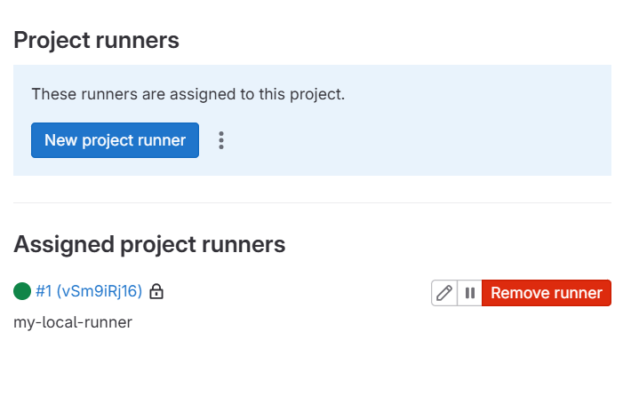
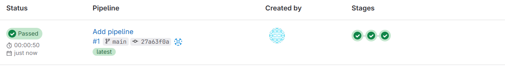

# Домашнее задание к занятию «GitLab» — Шушнов Александр

## Задание 1

**Текст задания:**
Разверните GitLab локально, используя Vagrantfile. Создайте новый проект и пустой репозиторий в нём. Зарегистрируйте gitlab-runner для этого проекта и запустите его в режиме Docker. В качестве ответа добавьте скриншоты с настройками раннера в проекте.

**Решение:**
GitLab успешно развернут локально с помощью Vagrant. Создан пустой проект `netology-test`. GitLab Runner зарегистрирован и запущен в Docker-контейнере на той же виртуальной машине.

Скриншот успешной регистрации раннера:
 

---

## Задание 2

**Текст задания:**
Запушьте репозиторий на GitLab, изменив origin. Создайте .gitlab-ci.yml, описав в нём все необходимые, на ваш взгляд, этапы. В качестве ответа в шаблон с решением добавьте: файл gitlab-ci.yml для своего проекта и скриншоты с успешно собранными сборками.

**Решение:**
Репозиторий был отправлен в локальный GitLab. Был создан файл `.gitlab-ci.yml` с тремя этапами: сборка (build), тестирование (test) и развертывание (deploy).

Содержимое файла `.gitlab-ci.yml`:
```yaml
stages:
  - build
  - test
  - deploy

build_job:
  stage: build
  image: alpine:latest
  script:
    - echo "Начинаем сборку проекта..."
    - echo "Сборка успешно завершена!"

test_job:
  stage: test
  image: alpine:latest
  script:
    - echo "Запуск unit-тестов..."
    - echo "Все тесты пройдены успешно (100%)"

deploy_job:
  stage: deploy
  image: alpine:latest
  script:
    - echo "Развертывание приложения на сервере..."
    - echo "Деплой прошел успешно!"
```
Скриншот успешно пройденного пайплайна (Pipeline Passed):
